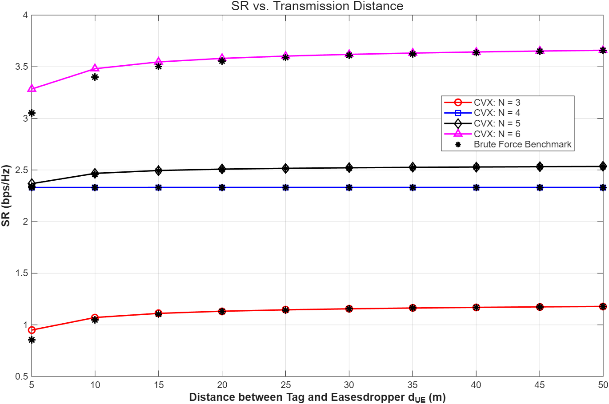
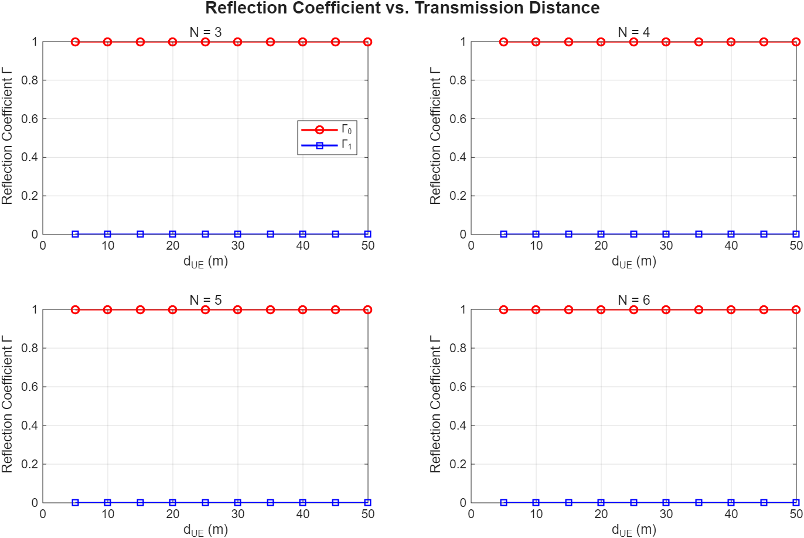
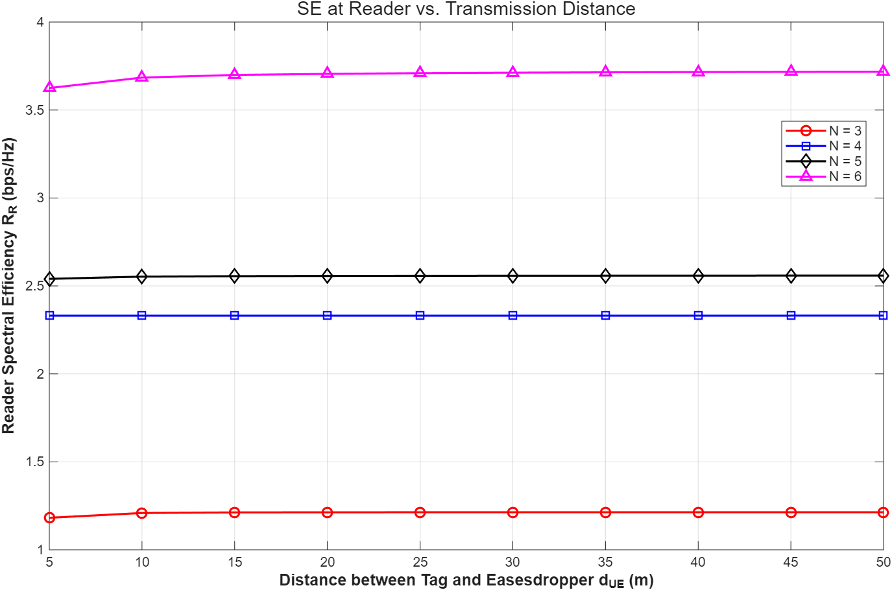
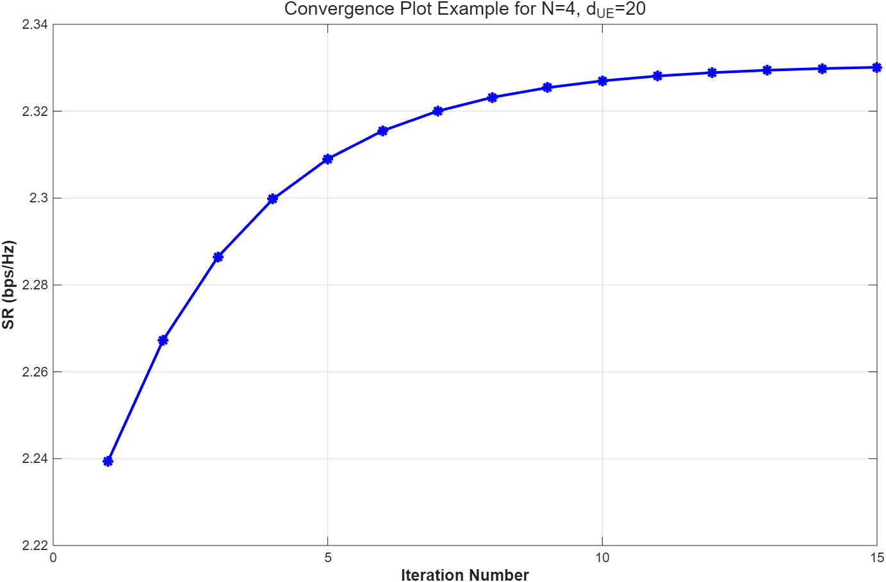

# Backscatter Physical Layer Security

MATLAB simulation and optimization of a multi-antenna backscatter communication system with physical layer security.

## Overview

This project investigates physical layer security in a monostatic backscatter communication system consisting of a multi-antenna reader, a passive backscatter device, and an eavesdropper.

The objective is to improve the achievable secrecy rate by jointly optimizing the backscatter reflection coefficient and the transmit/receive beamforming design.

## System Model

The considered system includes:

- A multi-antenna reader for signal transmission and reception
- A passive backscatter device
- An eavesdropper
- Forward and backscatter wireless channels
- Backscatter reflection coefficient optimization

The system performance is evaluated in terms of the achievable secrecy rate.

## Optimization Approach

The joint optimization problem is addressed using an alternating optimization framework.

The main techniques include:

- Alternating optimization
- Successive Convex Approximation (SCA)
- Semidefinite Relaxation (SDR)
- Transmit precoding optimization
- Receive combining optimization
- Reflection coefficient optimization

## Tools

- MATLAB
- CVX

## Getting Started

### Requirements

- MATLAB
- CVX

### Running the Simulation

The MATLAB scripts implement the system model and optimization algorithms used to evaluate the secrecy performance of the backscatter communication system.

Further implementation details and simulation results are provided in the repository.

## Results

### Secrecy Rate vs. Eavesdropper Distance

The achievable secrecy rate increases as the distance between the tag and the eavesdropper grows, since the increased propagation loss weakens the eavesdropping link.

Increasing the number of reader antennas also improves the secrecy rate through enhanced spatial beamforming capability. The optimized solution is compared with a brute-force benchmark.

### Optimized Reflection Coefficients

The optimized reflection coefficients remain at `Gamma_0 = 1` and `Gamma_1 = 0` across the considered distances and antenna configurations.

Under the selected transmit power, the harvested energy is sufficient to satisfy the tag's energy constraint. The optimization therefore selects the maximum feasible reflection contrast.

### Reader Spectral Efficiency

The reader spectral efficiency remains nearly constant as the tag-to-eavesdropper distance changes because the reader-to-tag distance is fixed at 10 m.

Increasing the number of reader antennas significantly improves the legitimate-link spectral efficiency.

### Algorithm Convergence

The alternating optimization algorithm progressively converges over successive iterations.

A damped SCA update with a step size of `0.3` is applied to improve numerical stability. The example below shows the convergence behavior for `N = 4` and `d_UE = 20 m`.

